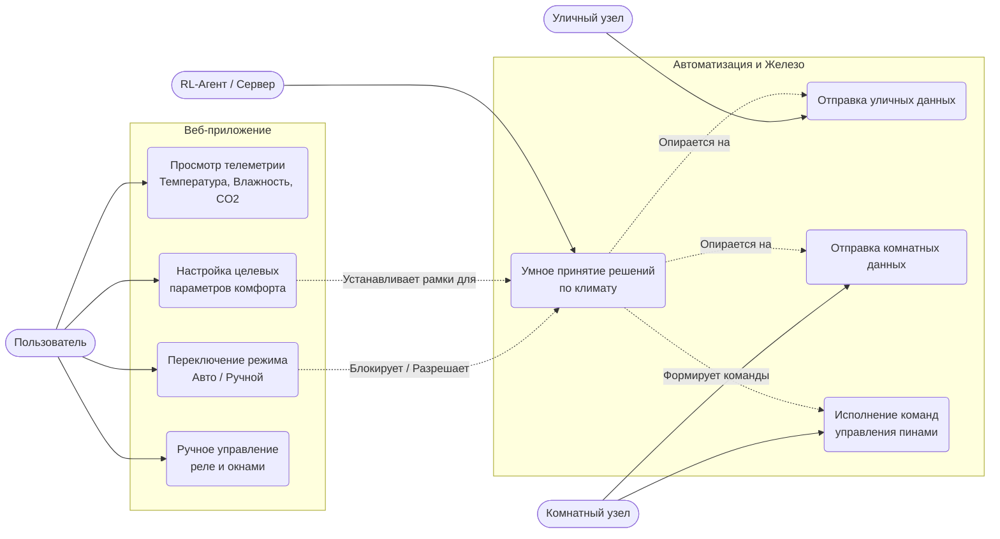
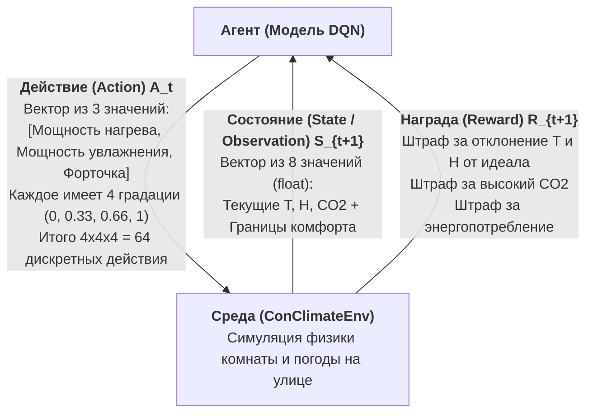
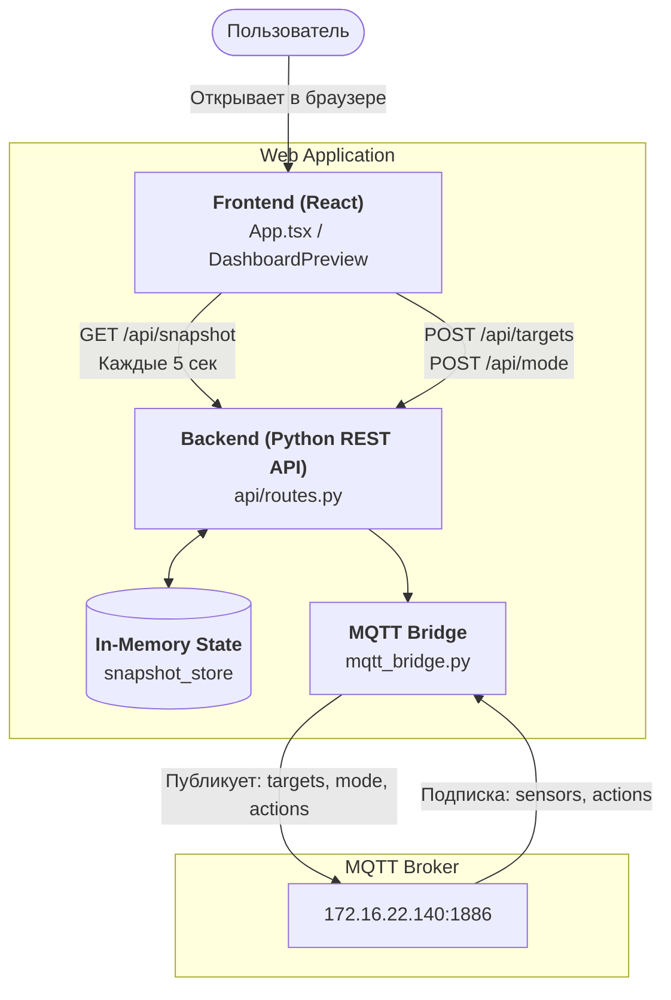
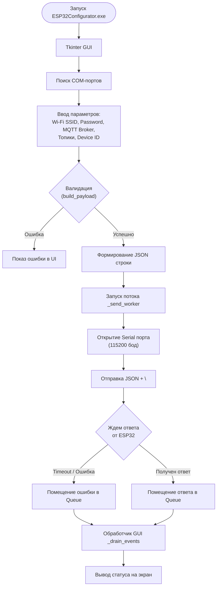

# Архитектура и алгоритмы проекта (Диаграммы)

Здесь представлены диаграммы для всех основных компонентов системы. 

## 1. Общая структурная схема системы (Architecture Diagram)

Эта схема показывает, как физические устройства и программные компоненты (микроконтроллеры, сервер и веб-приложение) обмениваются данными друг с другом через MQTT-брокер.

```mermaid
graph TD
    %%{init: {"flowchart": {"curve": "step"}}}%%
    subgraph "Уличный блок (Outdoor Controller)"
        OutSensors[Датчики: BME280, MQ-135]
        ESP_Out[ESP32 Outdoor Firmware]
    end

    subgraph "Комнатный блок (Indoor Controller)"
        InSensors[Датчики: BME280, MQ-135]
        ESP_In[ESP32 Room Firmware]
        Actuators[Реле: Обогреватель, Кондиционер,<br>Увлажнитель, Окна, Вытяжка]
    end

    subgraph "Серверная часть"
        MQTT_Broker[MQTT Broker<br>172.16.22.117:1883]
        PythonServer[Python Server<br>server.py]
        RL_Agent[RL Агент<br>DQN Model]
    end
    
    subgraph "Клиентская часть"
        WebApp[Web Application]
    end

    OutSensors -->|Сырые данные| ESP_Out
    ESP_Out -->|Телеметрия (JSON)| MQTT_Broker
    
    InSensors -->|Сырые данные| ESP_In
    ESP_In -->|Телеметрия (JSON)| MQTT_Broker
    
    MQTT_Broker -->|Топик: iot_proj/sensors| PythonServer
    PythonServer <-->|Запрос действий / Получение состояния| RL_Agent
    
    PythonServer -->|Публикация (JSON)| MQTT_Broker
    MQTT_Broker -->|Топик: iot_proj/actions| ESP_In
    ESP_In -->|Управление пинами| Actuators
    
    WebApp -->|Смена режима / Установки комфорта| MQTT_Broker
    MQTT_Broker -->|Топики: iot_proj/mode, iot_proj/targets| PythonServer
```

## 2. Диаграмма вариантов использования (UML Use Case)

Эта диаграмма показывает роли (Акторов) и основные сценарии использования (Use Cases) всей системы от лица пользователя, сервера и железа.



## 3. Сервер (`server.py`) - Алгоритм работы (Flowchart)

Эта блок-схема отражает реальный алгоритм работы сервера: процесс инициализации и строгую программную логику обработки входящих событий (без человеческого языка).

```mermaid
flowchart TD
    Start([Start server.py]) --> LoadModel[agent = DQN.load(path)]
    LoadModel --> InitMQTT[client = mqtt.Client()]
    InitMQTT --> Connect[client.connect(172.16.22.117)]
    Connect --> Sub[client.subscribe(sensors, targets, mode)]
    Sub --> LoopForever[client.loop_forever()]
    
    LoopForever -.-> OnMessage([on_message(client, userdata, msg)])
    OnMessage --> ParseJSON[data = json.loads(msg.payload)]
    
    ParseJSON --> IsTargetsTopic{msg.topic == 'iot_proj/targets'}
    
    IsTargetsTopic -- Да --> UpdateTargets[global_targets.update(data)] --> EndMsg([return])
    IsTargetsTopic -- Нет --> IsModeTopic{msg.topic == 'iot_proj/mode'}
    
    IsModeTopic -- Да --> UpdateMode[current_mode = data['mode']] --> EndMsg
    IsModeTopic -- Нет --> IsSensorsTopic{msg.topic == 'iot_proj/sensors'}
    
    IsSensorsTopic -- Да --> CheckMode{current_mode == 'manual'}
    IsSensorsTopic -- Нет --> EndMsg
    
    CheckMode -- Да --> EndMsg
    CheckMode -- Нет --> Validate[valid_data = validate_sensor_data(data)]
    
    Validate --> IsValid{valid_data != None}
    IsValid -- Нет --> EndMsg
    IsValid -- Да --> PrepareObs[obs = np.array(valid_data + targets)]
    
    PrepareObs --> Predict[action, _ = agent.predict(obs)]
    Predict --> PubAction[client.publish('iot_proj/actions', action)] --> EndMsg
```

## 4. Среда обучения Reinforcement Learning (MDP Loop)

Эта схема показывает стандартную модель взаимодействия Агента и Среды (Марковский процесс принятия решений), основанную на актуальном коде из `iot_rl.ipynb`.



## 5. ESP32 Прошивки - Блок-схема основного цикла отправки телеметрии (`telemetry_task`)

Обе прошивки (outdoor и room) используют одинаковый цикл для чтения сенсоров и отправки данных.

```mermaid
flowchart TD
    Start([Start telemetry_task]) --> Loop[while true]
    Loop --> CheckMQTT{mqtt_client != NULL && mqtt_connected}
    
    CheckMQTT -- Да --> ReadBME[err = bmp280_read_float(...)]
    CheckMQTT -- Нет --> Wait[vTaskDelay(interval)]
    
    ReadBME --> CheckBME{err == ESP_OK}
    CheckBME -- Да --> ReadMQ[co2 = read_mq135_co2_ppm()]
    CheckBME -- Нет --> LogError[ESP_LOGE]
    
    ReadMQ --> CreateJSON[json = cJSON_CreateObject()]
    CreateJSON --> Publish[esp_mqtt_client_publish(json)]
    
    Publish --> Wait
    LogError --> Wait
    
    Wait --> Loop
```

## 6. ESP32 Room Firmware - Блок-схема обработки входящих команд (MQTT Event Handler)

Внутренний датчик комнаты также принимает команды от сервера (RL-агента) для управления реле (обогреватель, кондиционер и т.д.).

```mermaid
flowchart TD
    Start([mqtt_event_handler]) --> CheckTopic{event->topic == command_topic}
    
    CheckTopic -- Нет --> End([return])
    CheckTopic -- Да --> ParseJSON[root = cJSON_Parse(event->data)]
    
    ParseJSON --> ValidJSON{root != NULL}
    ValidJSON -- Нет --> LogWarn1[ESP_LOGW] --> End
    ValidJSON -- Да --> CheckAction{cJSON_IsNumber(action_item)}
    
    CheckAction -- Нет --> LogWarn2[ESP_LOGW] --> End
    CheckAction -- Да --> ApplyMask[apply_action_mask(action_item->valueint)]
    
    ApplyMask --> ParseBits[gpio_set_level(GPIO, action & bit)]
    ParseBits --> End
```

## 7. ESP32 - Блок-схема конфигурации по UART (`serial_config_task`)

Обе прошивки слушают UART для получения новой конфигурации сети и MQTT в формате JSON на лету.

```mermaid
flowchart TD
    Start([Start serial_config_task]) --> Loop[while true]
    Loop --> ReadUART[received = uart_read_bytes(...)]
    
    ReadUART --> HasData{received > 0}
    HasData -- Нет --> Loop
    HasData -- Да --> ParseChars[for each ch in rx_chunk]
    
    ParseChars --> IsNewline{ch == '\\n'}
    IsNewline -- Нет --> Buffer[line_buffer = ch]
    IsNewline -- Да --> ParseConfig[err = parse_config_payload(line_buffer)]
    
    Buffer --> HasData
    
    ParseConfig --> ValidConfig{err == ESP_OK}
    ValidConfig -- Нет --> SendError[send_serial_status('error')]
    ValidConfig -- Да --> SaveNVS[save_config_to_nvs(&new_config)]
    
    SaveNVS --> Success{err == ESP_OK}
    Success -- Нет --> SendError
    Success -- Да --> SendOK[send_serial_status('ok')] --> Restart([esp_restart()])
    
    SendError --> HasData
```

## 8. Веб-приложение (Smart Climate Dashboard)

Схема показывает потоки данных между фронтендом на React, бэкендом (с MQTT Bridge) и самим брокером. Веб-интерфейс получает актуальное состояние каждые 5 секунд и отправляет команды для смены целевых значений и ручного управления.



## 9. Десктоп-утилита конфигурации (ESP32 Configurator)

Приложение на `tkinter` для первоначальной прошивки параметров сети и MQTT в память микроконтроллера через USB.


